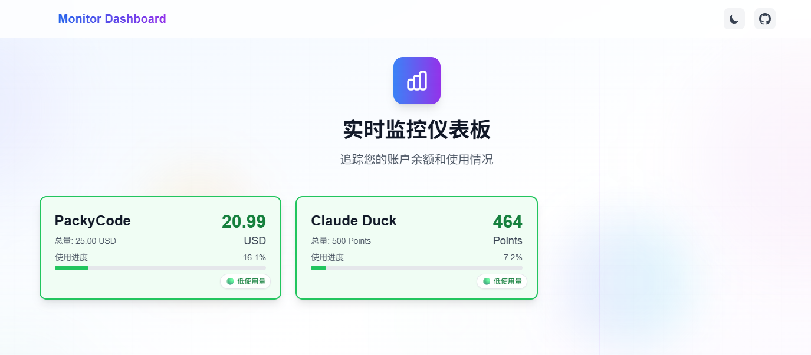
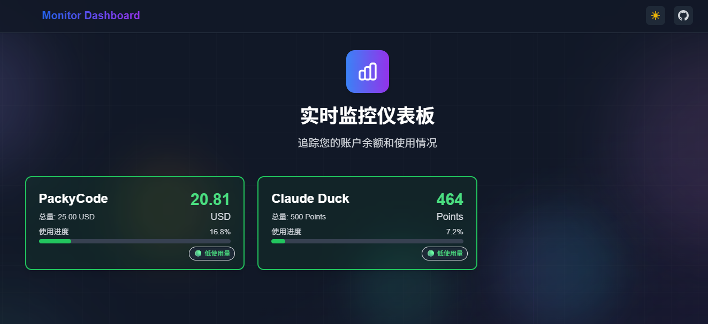

# Monitor Dashboard

一个基于 Next.js 构建的实时监控仪表板，用于追踪多个 API 的账户余额和使用情况。

## 预览

### 明亮模式


### 深色模式


## 功能特性

- 🔄 **实时监控**：统一 5 分钟缓存更新机制
- 🌙 **深色模式**：支持明暗主题切换
- 📊 **多种数据源**：支持多种 API 认证方式
- 💾 **本地缓存**：浏览器本地存储减少 API 请求
- 📱 **响应式设计**：适配桌面和移动设备
- ⚡ **动画效果**：美观的背景动画和过渡效果

## 技术栈

- **框架**: Next.js 15.3.4
- **语言**: TypeScript
- **样式**: Tailwind CSS
- **状态管理**: React Hooks
- **缓存**: localStorage
- **图标**: Heroicons

## 快速开始

### 1. 克隆项目

```bash
git clone https://github.com/zhiqing0205/monitor-dashboard.git
cd monitor-dashboard
```

### 2. 安装依赖

```bash
npm install
# 或者
yarn install
# 或者
pnpm install
```

### 3. 配置环境变量

复制环境变量示例文件：

```bash
cp .env.example .env.local
```

编辑 `.env.local` 文件，配置您的监控 API：

```env
NEXT_PUBLIC_MONITORS_CONFIG='[
  {
    "id": "example-api-1",
    "name": "示例 API 1",
    "url": "https://api.example.com/balance",
    "displayUnit": "USD",
    "total": 1000,
    "balanceField": "data.balance",
    "expiryField": "data.todayExpiry",
    "totalField": "data.totalAmount",
    "reverse": false,
    "decimals": 2,
    "auth": {
      "type": "bearer",
      "token": "your-bearer-token"
    }
  }
]'
```

### 4. 运行开发服务器

```bash
npm run dev
# 或者
yarn dev
# 或者
pnpm dev
```

打开 [http://localhost:3000](http://localhost:3000) 查看结果。

## 配置说明

### 监控配置参数

每个监控项支持以下配置：

| 字段 | 类型 | 必填 | 说明 |
|------|------|------|------|
| `id` | string | ✅ | 唯一标识符 |
| `name` | string | ✅ | 显示名称 |
| `url` | string | ✅ | API 地址 |
| `displayUnit` | string | ❌ | 显示单位（如 USD、BTC） |
| `total` | number | ❌ | 总额度 |
| `balanceField` | string | ❌ | 余额字段路径（默认 "balance"） |
| `expiryField` | string | ❌ | 过期字段路径 |
| `totalField` | string | ❌ | 总额字段路径 |
| `reverse` | boolean | ❌ | 是否反转计算（默认 false） |
| `decimals` | number | ❌ | 小数位数（默认 2） |
| `link` | string | ❌ | 点击卡片跳转的链接 |
| `auth` | object | ❌ | 认证配置 |

### 认证方式

支持多种认证方式：

#### Bearer Token
```json
{
  "auth": {
    "type": "bearer",
    "token": "your-bearer-token"
  }
}
```

#### Basic Auth
```json
{
  "auth": {
    "type": "basic",
    "username": "your-username",
    "password": "your-password"
  }
}
```

#### API Key
```json
{
  "auth": {
    "type": "apikey",
    "apiKey": "your-api-key"
  }
}
```

#### Cookie
```json
{
  "auth": {
    "type": "cookie",
    "cookie": "session=abc123; auth_token=xyz789"
  }
}
```

#### 自定义 Authorization
```json
{
  "auth": {
    "type": "authorization",
    "authorization": "Custom your-custom-auth-string"
  }
}
```

### 反转计算说明

- `reverse: false`（默认）：API 返回剩余余额，直接显示
- `reverse: true`：API 返回已使用量，计算余额 = total - used

### 链接跳转说明

- `link` 字段为可选配置，用于点击卡片时跳转到指定网站
- 当配置了 `link` 字段时，卡片会显示外链图标指示器
- 悬浮到卡片上时会显示炫彩渐变边框动画效果
- 点击卡片将在新标签页中打开链接

### 嵌套字段路径

支持点号分隔的字段路径：
- `"balance"` → `response.balance`
- `"data.balance"` → `response.data.balance`
- `"result.account.balance"` → `response.result.account.balance`

## 项目结构

```
monitor-dashboard/
├── src/
│   ├── app/                    # Next.js App Router
│   │   ├── api/proxy/         # API 代理路由
│   │   ├── globals.css        # 全局样式
│   │   └── page.tsx           # 主页面
│   ├── components/            # React 组件
│   │   ├── AnimatedBackground.tsx
│   │   ├── GlobalCountdown.tsx
│   │   ├── MonitorCard.tsx
│   │   └── Navbar.tsx
│   ├── lib/                   # 工具库
│   │   ├── api.ts            # API 请求
│   │   ├── cache.ts          # 缓存管理
│   │   ├── config.ts         # 配置解析
│   │   └── debug.ts          # 调试工具
│   └── types/                 # TypeScript 类型
│       └── config.ts
├── .env.example              # 环境变量示例
├── .env.local               # 本地环境变量
├── tailwind.config.ts       # Tailwind 配置
└── README.md               # 项目说明
```

## 开发说明

### 构建生产版本

```bash
npm run build
```

### 代码检查

```bash
npm run lint
```

### 调试模式

开发环境会显示详细的调试信息，生产环境会自动隐藏。

## 部署

### Vercel 部署

推荐使用 [Vercel](https://vercel.com) 进行部署：

1. 将项目推送到 GitHub
2. 在 Vercel 中导入项目
3. 配置环境变量 `NEXT_PUBLIC_MONITORS_CONFIG`
4. 部署完成

### 其他平台

项目可以部署到任何支持 Next.js 的平台，如：
- Netlify
- Railway
- Heroku
- 自建服务器

## 许可证

MIT License

## 贡献

欢迎提交 Issue 和 Pull Request！

## 联系方式

- GitHub: [zhiqing0205/monitor-dashboard](https://github.com/zhiqing0205/monitor-dashboard)